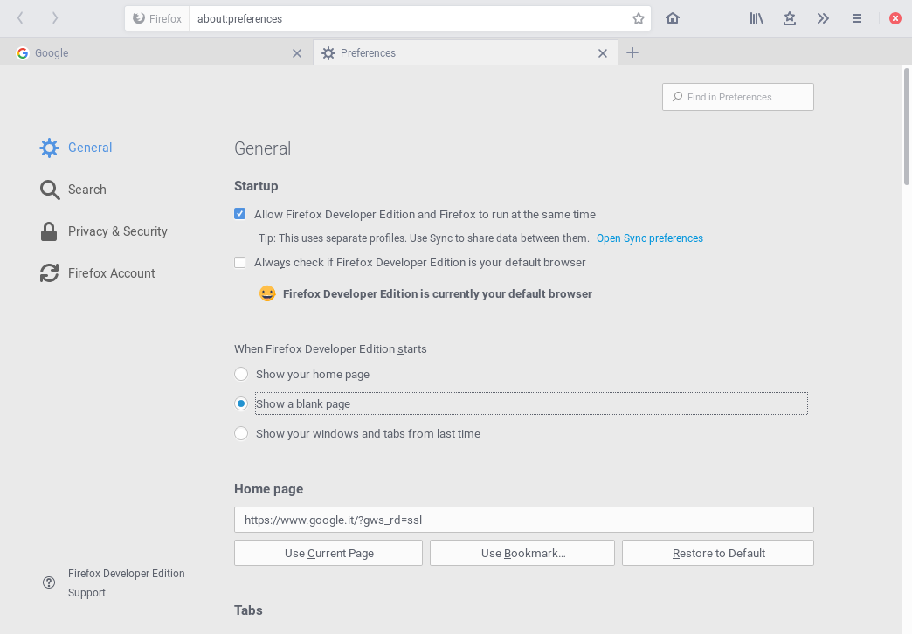

# Firefox ARC Theme



## Description

This is a bunch of CSS code to make Firefox 59+ look closer to [Arc-solid](https://github.com/horst3180/arc-theme) theme.
It styles the UI and internal Firefox' pages like `about:` and`view-source:`.

The `master` branch is currently tracking **Firefox 61**.

## Installation

Extensions can no longer style UI elements, but we can still use good old
`userChrome.css` and `userContent.css` files. Just drop this repo to your
`chrome` directory:

1. Go to your Firefox profile's directory, if it's located in the default
  location, this should work:

  ```sh
  cd ~/.mozilla/firefox/*.default
  ```

2. Create a `chrome` directory if it doesn't exist.

  ```sh
  mkdir -p chrome
  cd chrome
  ```

3. Clone this repo to a subdirectory:

  ```sh
  git clone https://github.com/lbrfabio/firefox-gnome-theme.git
  ```

4. Create single-line user CSS files if non-existent or empty (at least one line
  is needed for `sed`):

  ```sh
  [[ -s userChrome.css ]] || echo >> userChrome.css
  [[ -s userContent.css ]] || echo >> userContent.css
  ```

5. Import this theme at the beginning of the CSS files (all `@import`s must come
  before any existing `@namespace` declarations):

  ```sh
  sed -i '1s/^/@import "firefox-gnome-theme\/userChrome.css";\n/' userChrome.css
  sed -i '1s/^/@import "firefox-gnome-theme\/userContent.css";\n/' userContent.css
  ```

6. Enable the theme in the `firefox-gnome-theme/userChrome.css` file. Open it
  with a text editor and follow instructions to enable one of the theme variants.
  You can also enable extra features here. Keep in mind this file might change in
  future versions and your configuration will be lost. You can copy the `@import`s
  you want to enable to the `userChrome.css` file directly in your `chrome`
  directory if you want it to survive updates. Remember all `@import`s must be at
  the top of the file, before other statements.

Current list of optional features:
* csd.css: enable client side decoration(CSD). Optional: csd-X-button.css where X is 1(default), 2, 3.
* findBar.css: compact findbar (top left corner)
* autocomplete.css: different colors and padding
* popup.css: different colors, padding, margin and some menu items are hidden
* tab-wheel-scroll.css: rotate tabs with scroll wheel
* extensions.css: changes for a few extensions
* inactive-state.css: apply inactive state when leaving focus
* private-mode.css: dark mode while in private mode

7. Optionally you can enable styling of Firefox' internal pages in the
  `userContent.css` file analogous to the `userChrome.css` file.

You can get rid of the title bar for now but you will be able to do it 
in Firefox 60, when Firefox adds client-side decoration support.
By default csd.css is enabled for just 1 button (close).

## Development

If you wanna mess around the styles and change something, you might find these
things useful.

To use the Inspector to debug the UI, open the developer tools (F12) on any
page, go to options, check both of those:

- Enable browser chrome and add-on debugging toolboxes
- Enable remote debugging

Now you can close those tools and press Ctrl+Alt+Shift+I to Inspect the browser
UI.

Also you can inspect any GTK3 application, for example type this into a terminal
and it will run Epiphany with the GTK Inspector, so you can check the CSS styles
of its elements too.

```sh
GTK_DEBUG=interactive epiphany
```

Feel free to use any parts of my code to develop your own themes, I don't force
any specific license on your code.

